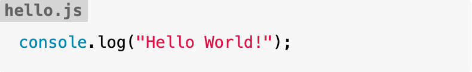

# markdown-it-named-code-blocks

A [markdown-it](https://github.com/markdown-it/markdown-it#readme) plugin to create named code blocks.

[](https://github.com/tsutsu3/markdown-it-named-code-blocks/actions/workflows/ci.yml)
[](https://www.npmjs.org/package/markdown-it-named-code-blocks)
[](https://codeclimate.com/github/tsutsu3/markdown-it-named-code-blocks)
[](https://codecov.io/gh/tsutsu3/markdown-it-named-code-blocks)
[](https://github.com/tsutsu3/markdown-it-named-code-blocks/LICENSE)

## 🧐 About

With this plugin you can create named code blocks like:

````txt
```js:hello.js
console.log("Hello World!")
```
````

Rendered as:

```html
<pre class="named-fence-block"><code class="language-js">console.log(&quot;Hello World!&quot;);
</code><div class="named-fence-filename">hello.js</div></pre>
```

After applying the css, it looks like this:



## 🏁 Getting Started

### Prerequisites

- [Node.js](https://nodejs.org/)

### Installing

```bash
npm install markdown-it-named-code-blocks
```

## 🎈 Usage

Use this same as a normal markdown-it plugin:

```js
const md = require("markdown-it");
const hljs = require("highlight.js");
const namedCodeBlocks = require(".");

const parser = md({
  highlight: function (str, lang) {
    if (lang && hljs.getLanguage(lang)) {
      return (
        '<pre class="hljs"><code>' +
        hljs.highlight(str, { language: lang, ignoreIllegals: true }).value +
        "</code></pre>"
      );
    }

    return (
      '<pre class="hljs"><code>' + md.utils.escapeHtml(str) + "</code></pre>"
    );
  }
}).use(namedCodeBlocks);

const str = '```js:hello.js\nconsole.log("Hello World!");\n```';

const result = parser.render(str);

console.log(result);
```

Output:

```html
<pre class="hljs named-fence-block"><code><span class="hljs-variable language_">console</span>.<span class="hljs-title function_">log</span>(<span class="hljs-string">&quot;Hello World!&quot;</span>);
</code><div class="named-fence-filename">hello.js</div></pre>
```

Apply CSS like this:

```css
.named-fence-block {
  position: relative;
  padding-top: 2em;
}

.named-fence-filename {
  position: absolute;
  top: 0;
  left: 0;
  padding: 0 4px;
  font-weight: bold;
  color: #000000;
  background: #c0c0c0;
  opacity: 0.6;
}
```

Rendered:


If you want to enable inline CSS:

```js
const parser = md().use(namedCodeBlocks, {isEnableInlineCss: true});
```

Output:

```html
<pre class="hljs named-fence-block" style="position: relative; padding-top: 2em;"><code><span class="hljs-variable language_">console</span>.<span class="hljs-title function_">log</span>(<span class="hljs-string">&quot;Hello World!&quot;</span>);
</code><div class="named-fence-filename" style="position: absolute; top: 0; left: 0; padding: 0 4px; font-weight: bold; color: #000000; background: #c0c0c0; opacity: .6;">hello.js</div></pre>
```

## 🎉 License

Distributed under the `MIT` License. See [LICENSE](https://github.com/tsutsu3/markdown-it-named-code-blocks/blob/master/LICENSE) for more information.
