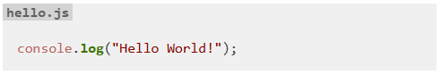

# markdown-it-named-code-blocks

A [markdown-it](https://github.com/markdown-it/markdown-it#readme) plugin to create named code blocks.

[](https://travis-ci.org/tsutsu3/markdown-it-named-code-blocks)
[](https://www.npmjs.org/package/markdown-it-named-code-blocks)
[](https://codeclimate.com/github/tsutsu3/markdown-it-named-code-blocks)
[](https://github.com/tsutsu3/markdown-it-named-code-blocks/LICENSE)

## 🧐 About

With this pllugin you can create named code blocks like:

~~~
```js:hello.js
console.log("Hello World!")
```
~~~

Rendered as:

```html
<pre class="named-fence-block"><code class="language-js">console.log(&quot;Hello World!&quot;);
</code><div class="named-fence-filename">hello.js</div></pre>
```

After applying the css, it looks like this:



## 🏁 Getting Started

### Prerequisites

- [Node.js](https://nodejs.org/)

### Installing

```bash
npm install markdown-it-named-code-blocks
```

## 🎈 Usage

Use this same as a normal markdown-it plugin:

```js
const md = require('markdown-it');
const namedCodeBlocks = require('markdown-it-named-code-blocks');

const parser = md().use(namedCodeBlocks);

const str = '```js:hello.js\nconsole.log("Hello World!);```'

const result = parser.render(str);
```

Apply CSS like this:

```css
.named-fence-block {
  position: relative;
  padding-top: 2em;
}

.named-fence-filename {
  position: absolute;
  top: 0;
  left: 0;
  padding: 0 4px;
  font-weight: bold;
  color: #000000;
  background: #c0c0c0;
  opacity: 0.6;
}
```

Rendered:


If you want to enable inline CSS:

```js
const parser = md().use(namedCodeBlocks, {isEnableInlineCss: true});
```

```html
<pre class="hljs named-fence-block" style="position: relative; padding-top: 2em"><code>console.log(&quot;Hello World!&quot;)
</code><div class="mincb-name" style="position: absolute; top: 0; left: 0; padding: 0 4px; font-weight: bold; color: #000000; background: #c0c0c0; opacity: .6;">hello.js</div></pre>
```


## 🎉 License

Distributed under the `MIT` License. See [LICENSE](https://github.com/tsutsu3/markdown-it-named-code-blocks/blob/master/LICENSE) for more information.
